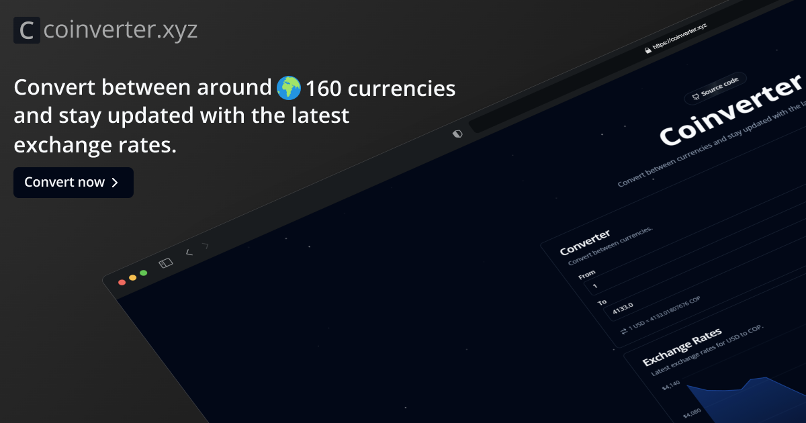

  
  <h1>Coinverter</h1>
  

    Convert between around 🌎 160 currencies and stay updated with the latest exchange rates.
  

  

    <a href="https://coinverter.xyz">View</a>
   • 
    <a href="https://github.com/sneyderdev/coinverter/issues/">Report Bug</a>
   • 
    <a href="https://github.com/sneyderdev/coinverter/issues/">Request Feature</a>
  

## :star2: About

Coinverter is currency converter app that allows you to convert between around 160+ currencies, providing real-time exchange rates powered by [CurrencyBeacon](https://currencybeacon.com/).

### :dart: Features

- Real-time exchange rates.
- Currency conversion between all supported currencies.
- Historical exchange rates for the last 30 days.
- Dark mode support.

### :space_invader: Tech Stack

- [Astro](https://astro.build/)
- [TypeScript](https://www.typescriptlang.org/)
- [Tailwind CSS](https://tailwindcss.com/)
- [React](https://react.dev/)
- [shadcn/ui](https://ui.shadcn.com/)
